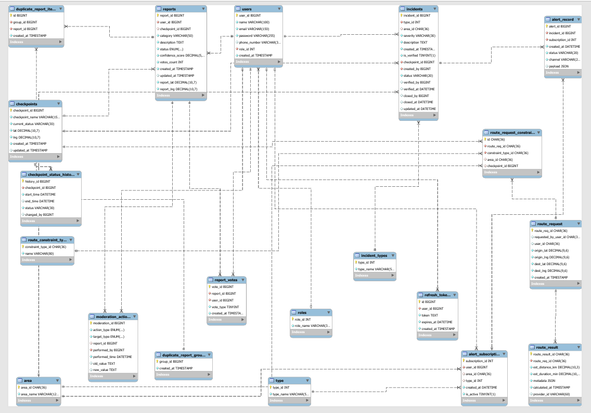

# 🚗 Wasel Palestine - Smart Mobility API

## 📌 Overview

Wasel Palestine is a backend RESTful API platform designed to support mobility intelligence in Palestine. The system provides structured and real-time information about checkpoints, road incidents, user reports, and route estimation.

The platform aggregates data and exposes it through versioned APIs that can be consumed by mobile applications, web dashboards, or third-party systems.

---

## 🛠️ Tech Stack

* Node.js
* Express.js
* Relational Database
* JWT Authentication (Access + Refresh Tokens)
* OpenStreetMap API
* CORS
* API-Dog (API Documentation & Testing)
* k6 (Planned for performance testing)

---

## 🏗️ Architecture

The system follows a **layered architecture**:

* **Controller Layer** → Handles HTTP requests and responses
* **Service Layer** → Contains business logic
* **Repository Layer** → Handles database operations
* **External Services Layer** → Integrates with OpenStreetMap

This architecture ensures:

* Separation of concerns
* Scalability
* Maintainability

---

## 🗄️ Database Design

The system uses a relational database designed to support reporting, moderation, routing, and alerts.

### Core Entities

* User
* Role
* Report
* Duplicate Report
* Moderation Actions
* Checkpoints
* Status History
* Incidents
* Type
* Route Request
* Route Result
* Route Constraint Type
* Route Request Constraint
* Alert Subscription
* Alert Record
* Area

### Key Features

* Users can create reports
* Reports can be voted on
* Duplicate reports detection supported
* Moderation actions are fully auditable
* Checkpoints maintain status history
* Route requests support constraints (avoid checkpoints/areas)
* Alerts triggered by incidents

---

## 📊 Database ERD



---

## 🔗 API Design

All endpoints follow RESTful standards and are versioned:

```bash
/api/v1/...
```

### 📌 Reports Endpoints

#### 🔹 Create Report

```http
POST /api/v1/reports
```

```json
{
  "category": "accident",
  "description": "another accident near checkpoint",
  "report_lat": 32.22,
  "report_lng": 35.26
}
```

---

#### 🔹 Get All Reports

```http
GET /api/v1/reports
```

---

#### 🔹 Get Report By ID

```http
GET /api/v1/reports/{id}
```

---

#### 🔹 Vote on Report

```http
POST /api/v1/reports/{id}/vote
```

```json
{
  "vote_type": 1
}
```

---

#### 🔹 Remove Vote from Report

```http
DELETE /api/v1/reports/{id}/vote
```

---

## 🔐 Authentication & Security

The system uses **JWT Authentication**:

* Access Token
* Refresh Token

Features:

* Secured endpoints
* Token-based authentication
* CORS enabled for cross-origin requests

---

## 🌍 External API Integration

The system integrates with:

* **OpenStreetMap API** → for geolocation and route estimation

Handled challenges:

* External API reliability
* Response handling
* Data integration

---

## 🧪 API Documentation & Testing

All APIs are documented and tested using **API-Dog**.

Includes:

* Endpoint definitions
* Request/response schemas
* Authentication setup
* Test cases

---

## ⚡ Performance Testing

Performance testing is planned using **k6**.

Planned scenarios:

* Read-heavy workloads
* Write-heavy workloads
* Mixed workloads
* Spike testing
* Soak testing

Metrics:

* Response time
* Latency (p95)
* Throughput
* Error rate

---

## 🐳 Deployment

Docker support is planned and will be added in future deployment stages.

---

## ⚙️ Installation

Clone the repository:

```bash
git clone https://github.com/sondosalqu/WaselPalestine-.git
```

Navigate to the project folder:

```bash
cd WaselPalestine-
```

Install dependencies:

```bash
npm install
```

Run the development server:

```bash
npm run dev
```


## 👥 Team Members

* Sondos Alqotob
* Mayar Obeid
* Haya Khattabeh


## 📌 Project Notes

This project was developed as part of the Advanced Software Engineering course. It focuses on backend engineering concepts including API design, system architecture, authentication, external integrations, and performance considerations.

---
