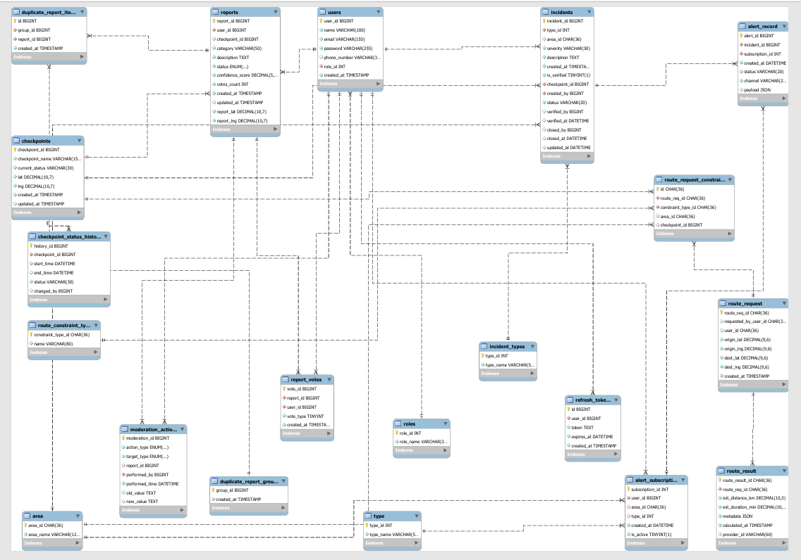

# 🚗 Wasel Palestine - Smart Mobility API

## 📌 Overview

Wasel Palestine is a backend RESTful API platform designed to support mobility intelligence in Palestine. The system provides structured and real-time information about checkpoints, road incidents, user reports, and route estimation.

The platform aggregates data and exposes it through versioned APIs that can be consumed by mobile applications, web dashboards, or third-party systems.

---

## 🛠️ Tech Stack

* Node.js
* Express.js
* MySQL (Relational Database)
* Sequelize ORM + Raw Queries
* JWT Authentication (Access + Refresh Tokens)
* OpenStreetMap API
* OpenWeather API
* API-Dog (API Documentation & Testing)
* k6 (Performance & Load Testing)
* Docker & Docker Compose

---
## 🔹 Why Node.js + Express + MySQL?

The selected technology stack was chosen based on the following engineering considerations:

- **Scalability:** Node.js uses a non-blocking, event-driven architecture, making it suitable for handling multiple concurrent API requests efficiently.

- **Security:** JWT-based authentication (access and refresh tokens) ensures secure communication and controlled access to protected endpoints.

- **Maintainability:** Express.js provides a simple and modular structure, while Sequelize ORM helps organize database interactions cleanly, making the system easier to maintain and extend.

- **Development Efficiency:** The JavaScript ecosystem offers fast development, extensive libraries, and strong community support, reducing development time and complexity.

- **Database Reliability:** MySQL provides a robust relational database system with strong support for structured data, transactions, and data integrity.

---

## Architecture

The system follows a layered architecture:

- **Routes layer** → Maps HTTP endpoints to the correct controller
- **Middleware layer** → Handles auth, validation, and logging
- **Controller layer** → Handles HTTP requests and sends responses
- **Service layer** → Contains business logic and external API
- **Model layer** → Handles database schema and queries 

**Why this architecture?**

- Separation of concerns
- Scalability
- Maintainability
- Easier testing and debugging
  
## 🗄️ Database Design

### Core Entities

User, Role, Report, Duplicate Report, Moderation Actions, Checkpoints, Status History, Incidents, Type, Route Request, Route Result, Route Constraint Type, Route Request Constraint, Alert Subscription, Alert Record, Area

### Key Features

* Users can create reports
* Reports support voting and duplication detection
* Moderation actions are fully tracked
* Checkpoints maintain historical status
* Routes support constraints
* Alerts triggered by incidents

---

## 📊 Database ERD



---

## 🔗 API Design

Base URL:

```bash
/api/v1/
```
## 🧠 API Design Rationale

The API follows RESTful principles to ensure scalability and maintainability.

- Versioning (/api/v1) enables backward compatibility
- Resource-based endpoints improve clarity
- HTTP methods used correctly:
  - GET → fetch data
  - POST → create resources
  - PATCH → partial updates
  - DELETE → remove resources
- Separation between resources and actions improves design clarity

  
### Example Endpoints
### Checkpoints

* GET `/checkpoints` — List all checkpoints
* GET `/checkpoints/:id` — Get checkpoint details
* POST `/checkpoints` — Create checkpoint (Admin/Moderator)
* PUT `/checkpoints/:id` — Update checkpoint
* DELETE `/checkpoints/:id` — Delete checkpoint

### Checkpoint Status History

* GET `/checkpoints/:id/status-history` — Get checkpoint history
* POST `/checkpoints/:id/status-history` — Add status update

### Incidents

* GET `/incidents` — List incidents with filtering, sorting, pagination
* GET `/incidents/:id` — Get incident details
* POST `/incidents` — Create incident
* PATCH `/incidents/:id/verify`
* PATCH `/incidents/:id/close`

---
## 🌍 External API Integration Details

### OpenStreetMap
Used for route estimation and geolocation.

Handled:
- Request timeouts
- Error handling (fallback responses)
- Data transformation into internal format

### OpenWeather API
Used to enhance incident context based on weather.

Handled:
- API authentication
- Rate limiting protection
- Basic caching to reduce repeated calls


---
## 🔐 Authentication & Security

* JWT (Access + Refresh Tokens)
* Role-based access control
* Password hashing (bcrypt)
* Input validation & error handling
* CORS enabled


---

## 🧪 API Documentation

All APIs documented using **API-Dog**:

* Request/response schemas
* Auth flows
* Testing scenarios

---
## Performance & Load Testing (k6)

Five scenarios were tested to evaluate system behavior under different load conditions.

| Scenario    | Load       | Duration | Avg       | p95     | Throughput  | Error |
|-------------|------------|----------|-----------|---------|-------------|-------|
| Read-heavy  | 20 VUs     | 1 min    | 13.88ms   | 26.43ms | 35.81 req/s | 0%    |
| Write-heavy | 40 VUs     | 5 min    | 717.93ms  | 1.97s   | 13.91 req/s | 0%    |
| Mixed       | 50 VUs     | 5 min    | 374.57ms  | 1.15s   | 36.27 req/s | 0%    |
| Spike       | 10→100 VUs | 3 min    | 15.77ms   | 33.33ms | 52.56 req/s | 0%    |
| Soak        | 20 VUs     | 15 min   | 17.26ms   | 30.94ms | 9.89 req/s  | 0%    |

**Key findings:**
- 0% error rate across all scenarios — system is stable under concurrent load
- Read, spike, and soak scenarios show excellent latency after database indexing optimization
- Write-heavy workload has higher latency due to synchronous DB inserts

> Full performance report available in
>  https://docs.google.com/document/d/1iY2OsLFjdewjN6kNIPM5hlmBZxMidMf9/edit?usp=sharing&ouid=115634196032624123883&rtpof=true&sd=true
---
## 🧪 Testing Strategy

The system was tested using multiple approaches:

- API-Dog → manual endpoint testing
- Authentication testing → JWT validation
- Role-based testing → access control verification
- Input validation testing → invalid and edge cases
- Performance testing → k6 load testing

Each endpoint was validated for correctness, security, and stability.

---
## 🐳 Deployment

```bash
docker compose up --build
```

* App: http://localhost:3000
* Database: MySQL (Docker)

---

## ⚙️ Run Locally

```bash
git clone https://github.com/sondosalqu/WaselPalestine-.git
cd WaselPalestine-
npm install
npm run dev
```

---

## ⚙️ Environment Variables

Create `.env` file:

```env
DB_NAME=myDB
DB_USER=root
DB_PASSWORD=your_db_password

DB_HOST=localhost
DB_PORT=3306

PORT=3000

JWT_ACCESS_SECRET=your_access_secret
JWT_REFRESH_SECRET=your_refresh_secret

OPENWEATHER_API_KEY=your_openweather_api_key
OPENWEATHER_BASE_URL=https://api.openweathermap.org/data/2.5

OSM_BASE_URL=https://router.project-osrm.org
NOMINATIM_BASE_URL=https://nominatim.openstreetmap.org

---

## 🔁 Workflow

* Feature branches
* Pull requests
* Clean commit messages

---

## 👥 Team

* Sondos Alqotob
* Maiar Obeid
* Haya Khattabeh

---

## 📌 Notes

This project demonstrates backend system design including:

* API architecture
* Database modeling
* Authentication
* External integrations
* Performance optimization
* Containerized deployment

---
